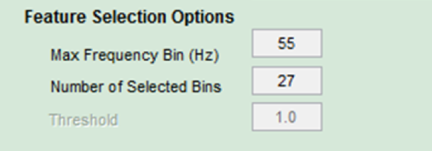

## Configuring the ECG Settings 

 **Figure 13**

### Preprocessing Settings

Click on Preprocessing Options under the ECG menu to adjust the settings for the ECG 
signal. The Downsample Rate determines how many samples per second the software will use. The extra information will be cut off. Set the Downsample Rate for your data. Window Size 
means (skipped).

 **Figure 14**

Figure 15 shows an example of an ECG signal. When Apply Trim Filter is selected the data 
that was corrupted during downsampling will be cut off. This is shown by the red lines. 
Apply 180 Hz Notch Filter means (skipped).

 **Figure 15**

### Feature Set Settings

Feature Set Options are the second option under the ECG icon in the menu bar. The 
Segmentation Options allow the user to segment their signals into individual heartbeats. 
Segments per Beat is (Skipped). Segmentation Boundaries allow the user to decide between 
two algorithms to determine heartbeats from the samples. Fixed Lengths Relative to Peaks 
uses an algorithm to find the R Peak. After finding it, the algorithm selects points 
(decimals?) before and after the peak. This is used as a heartbeat (See Figure 16).

 **Figure 16** 

Use the Before Primary Peak Length (samples) field to determine how many samples before 
the R Peak should be selected. The number of samples after the R Peak can be indicated 
using the After Primary Peak Length (samples) field. 

 **Figure 17**

The second option is under Segmentation Boundaries is Peak to Peak. The algorithms finds 
the peaks of the heartbeats and uses the information to determine the heartbeat. This 
beat will always be constant. These values were found to work the best. 

Train and Test Data Options allow the user to choose how many heartbeats are needed for 
each subject in order to create (define?) a feature set.

 **Figure 18**

The Number of Segments per Training Subject determine how many heartbeats are needed to 
train the classifier. Twelve was found to be most effective. The Number of Segments Per 
Test Subject determine how many heartbeats are needed to test the classifier. The Number 
of Segments Per Test is (skipped). Segment Selection Options determine which segments as 
indicated by the user will be used to test and train the classifier. 

 **Figure 19**

Random will select beats from various sections of data. The Consecutive option will pick 
the first twelve segments. The Manual option displays the heartbeat on the screen and 
asks the user if they would like to use it (Figure X, take Pic). 

The Closest to Mean option an algorithm to calculate the average heartbeat for each 
subject then selects twelve heartbeats that are closest to the overall average to use. 

 **Figure 20** 

According to the Law of Blank. Any signal can be broken down into individual waves that 
when brought back together will recreate the original signal. (Discrete R Transform? 
-Algorithm?)

DRT transforms the heartbeat into a matrix with a certain number of columns and where 
each row corresponds to a range of frequencies. 

Experiments show that after about 60 Hz information can be removed without interfering 
with the whole. Enter a number into the Max Frequency Bin (Hz) to tell the software to 
ignore any component of the decomposed signal that has a higher frequency than what is 
set in the field. 

 **Figure 21**

The algorithm uses a running window approach meaning it makes computations then moves 
forward to make more computations until the end of the data is reached and a matrix is 
developed. The number entered into the Window Length (samples) Field determines how many 
samples the algorithm will use at a time while the Window Step (samples) determines how 
far forward the algorithm will move. It will then compute the next set of samples. 

Column over 1000-defined by length
Rows 20-defined by step

Window Type is an argument to the DRT. Hamming and Hanning maintain the same function. 

 **Figure 22**

Use the Feature Selection Options to determine how features will be selected. The number 
of selected bins determines how many bins will be used. The rest will be zeroed out. An 
algorithm finds bins that are similar to the mean data but specific to the individual 
subject to use. 

