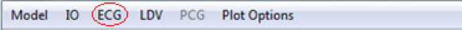
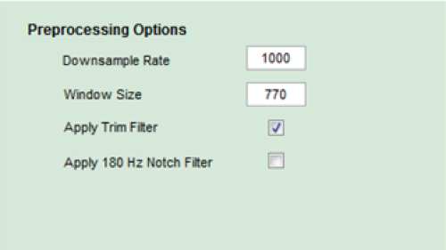
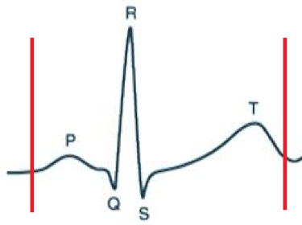
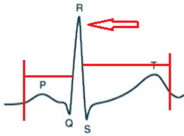
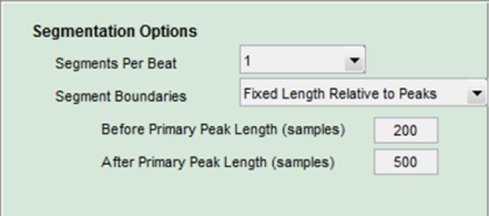
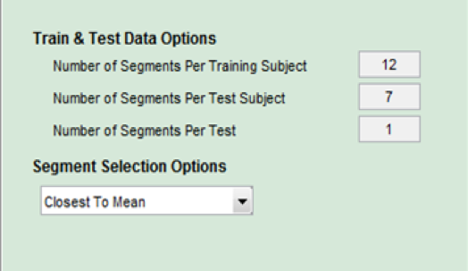
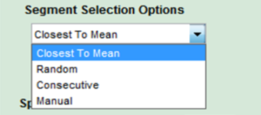
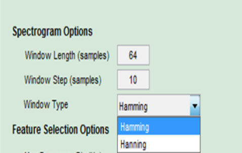
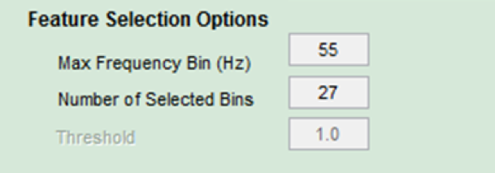

## Configuring the ECG Settings 

 **Figure 13**

### Preprocessing Settings

Click on `Preprocessing Options` under the ECG menu to adjust the preprocessing settings for the ECG signal. 

The `Downsample Rate` setting specifies how many samples per second the software will use. This is helpful if the recording device collected data at a higer rate than needed. 

The `Window Size` option ... (TODO).

 **Figure 14**

When `Apply Trim Filter` is selected, data that was corrupted during downsampling will be cut off as illustrated by the red lines in Figure 15.  

The 'Apply 180 Hz Notch Filter' setting ... (TODO).

 **Figure 15**

### Feature Set Settings

`Feature Set Options` are the second option under the ECG menu option in the menu bar. 

The `Segmentation Options` allow the user to determine how the system will segment the recordings into individual heartbeats.  

The `Segments Per Beat` setting ... (TODO). 

`Segmentation Boundaries` allow the user to choose what part of an individual heart beat will be used by the system.  The `Fixed Lengths Relative to Peaks' option splices the signal a fixed number of samples before and after the R-peak (shown in Figure 16). 

 **Figure 16** 

The `Before Primary Peak Length (samples)` field specifies where to start the splice and the `After Primary Peak Length (samples)` field specifies where to end the splice. 

 **Figure 17**

The second `Segmentation Boundaries` option is `Peak to Peak`. Here, the samples between two adjacent R-peaks are used.  This option produces variable length segments. 
 
The `Train and Test Data Options` allow the user to choose how many segments are used for each subject when training and testing the classifier.

 **Figure 18**

The `Number of Segments per Training Subject` setting determine how many segments per subject are used when training the classifier and the `Number of Segments Per Test Subject` setting determines how many segments per subject are used when testing the classifier. The `Number of Segments Per Test` setting specifies ... [TODO]. 

The `Segment Selection Options` determines how the segments will be chosen. 

 **Figure 19**

The `Closest to Mean` option calculates a nominal heartbeat (mean) for each subject using all of the subject's segments and selects the segments that are closest to the mean. `Random` will randomly select segments from all of the subject's segments. The 'Consecutive' option chooses segments according to the time in which they were recorded. The 'Manual' option displays each segment in a dialog box and allows the user to keep or discard the segment (TODO: Figure X, take Pic). 

 **Figure 20**

The 'Spectrogram Options' section allows the user to set the parameters for Matlab's [spectrogram](https://www.mathworks.com/help/signal/ref/spectrogram.html?requestedDomain=www.mathworks.com) function. 

 **Figure 21** 
TIS computes a spectrogram for each segment that is used for training and testing. The `Feature Selection Options` allow the user to restrict which bins of the spectrogram are included in the feature set for the user. 

The `Max Frequency Bin (Hz)` setting restricts TIS from using bins with frequencies higer than the value entered. The `Number of Selected Bins` field specifies how many bins to use when computing the feature set for a subject.  The values of all other bins are set to 0. 

[Next: Set Plot Options](Plot-Options.md) 
