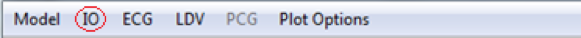
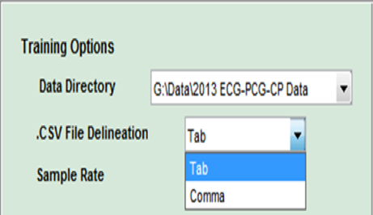
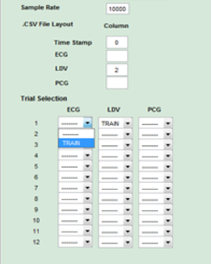

## Configuring the Input Settings 

When you select `IO` in the main menu, a submenu appears allowing you to select `Training Options` or `Testing Options`. Each of the submenus displays the same options in the pane on the lef.  You'll need to choose the Training Options menu to configure TIS to work with your training data, and then choose the Testing Options menu to configure TIS to work with your testing data.  

 
**Figure 10**

The `Data Directory` field allows you to select the data file. To change the value, right click on the input field and choose the directory where your data set resides. 

The `.CVS File Delineation` setting specifies how the data is delineated in the rows of your data files. For data that is separated by tabs select the `Tab` option, and for data that is separated by commas choose the `Comma` option. 

 
**Figure 11**

The `Sample Rate` option is used to specify the rate (samples per second) at which the input data was collected. 

The '.CVS File Layout` fields identify the type of data in each of the columns in your dataset.  For example if LDV data appears in column 2 of your data files, enter 2 in the box next to the LDV label. 

In the `Trial Selection` section, choose which trial files you'd like use for testing and training. 

 
**Figure 12**

