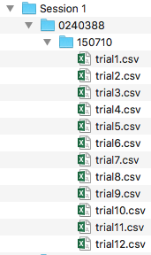

## Introduction 

### Overview
	
Biometrics are physical or biological traits that can be used to identify a subject. A biometric identification system uses biometric information to identify a subject. A thoracic identification system uses signals from the thoracic cavity, which encompasses everything inside the ribcage to identify a subject. A homogenous identification system trains and tests the classifier using the same types of data. For example, using ECG signals to train and test the classifier. A heterogenous system uses one type of signal to train the classifier and another type of signal to test it. For example, using PCG signals to train and ECG signals to test. TIS (Thoracic Identification System) is a homogenous thoracic biometric identification system.
 
### TIS Functionality

TIS requires two data sets, a training dataset and a testing dataset. This software attempts to map individuals in a testing dataset to individuals in a training dataset.  It computes a feature set of each subject in each set. It then attempts to match a feature set from the testing dataset with a feature set in the training dataset using a classifier. 
 
### System Requirements

For users to use TIS they must have Matlab R2015 or later installed on the host machine. In addition, the DSP system and signal processing toolboxes must be available in Matlab. 

### Data Requirements

The software works on the assumption that each recording for a subject is stored in a separate comma or tab delineated file where each column holds sampled data for a single modality (e.g. electro-cardiogram, phono-cardiogram, pulse). The order of the columns does not matter and additional data (e.g. timestamps) can be stored in other columns. 

It is assumed that the recordings are organized in the file system as shown in Figure 1 below.  The top-level folder should contain one folder for each subject. Each subject folder should contain a single folder to hold the recordings. The folder that contains the recordings should contain between 1 and 12 files. 

In Figure 1, the top-level folder is named Session 1, which contains a single subject folder named 0240388. The recordings are in a subfolder named 150710 indicating the date on which the recordings were taken. During the recording session on October 7, 2015 (12) recordings were taken and stored in separate csv files.  

 **Figure 1**

### Running TIS

There are six steps when using TIS. 

1. Install and Load TIS
2. Configure the model and classifier settings
3. Choose the training and testing input data 
4. Configure the preprocessing and feature set settings.
5. Set plot options to visualize process 
6. Calculate the training feature sets 
7. Calculate the testing feature sets 
8. Classify the testing feature sets against the training feature sets 

[Next: Installing and Loading TIS](Loading-TIS.md)
