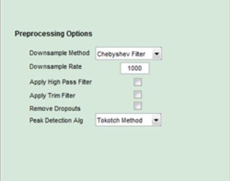
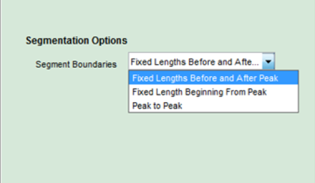
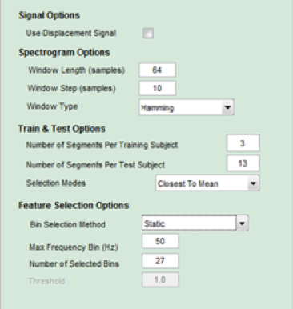

## LDV Settings

 
Figure 23

### Preprocessing Settings

The LDV `Preprocessing Options` allow the user to alter the original LDV signals prior to computing feature sets for each subject. 

The `Downsample Method` drop-down menu allows the user to choose between two different methods to down-sampling the data: 'Chebyshev Filter` or `Median Slide`.

The 'Downsample Rate` setting specifies how many samples per second the software will use. This is helpful if the recording device collected data at a higer rate than needed.

When `High Pass Filter` is selected, the signal is transform by removing lower frequency (less than 3 hertz) components from the signal.  

`Apply Trim Filter` will cause a few samples at the ends of each segment to be remove.  This is usefull if down-sampling causes the tails of the segment to be corrupted.

If `Remove Dropouts` is selected a despecking filter is applied to the signal. 

There are two options for a 'Peak Detection Alg`: `Tokotch Method` and 'O’Brien Likelihood`. The Tokotch Method is based on an algorithm created by Dr.Verne Leininger and Jose Corona in 2015. while the O’Brien Likelihood method uses an iterative sliding window approach. 

 
Figure 24 

### Segmentation Options 
 
The second option on the PCG menu is `Segmentation Options`.
 

Figure XXX

The Fixed Lengths Before and After Peak means that a set number of samples will be taken before and after the peak. 

Fixed Length Beginning From Peak means that a user set number of samples will be taken after a peak is found. 

Peak to Peak allows the user to define how many samples will be taken as the heartbeat between two peaks. This gives the user a fixed number of samples regardless of their subject’s heart rate. 

### Feature Set Settings

The third LDV submenu is `Feature Set Options`. 

 
Figure 25 

It is assumed that the LDV signal is a measurement of velocity. By checking `Use Displacement Signal`, the signal is converted to displacement using integration. 

The 'Spectrogram Options' section allows the user to set the parameters for Matlab's [spectrogram](https://www.mathworks.com/help/signal/ref/spectrogram.html?requestedDomain=www.mathworks.com) function. 

The `Train & Test Options` determine how many and which bins will be used to compute the feature sets for a subject. 

There are two `Bin Selection Methods`: `Static` and `Dynamic`. If Static is selected then ... (TODO)
If `Dynamic` is picked ... (TODO)

The `Max Frequency Bin (Hz)` setting restricts TIS from using bins with frequencies higer than the value entered. The `Number of Selected Bins` field specifies how many bins to use when computing the feature set for a subject.  The values of all other bins are set to 0. 

[Next: Set Plot Options](Plot-Options.md)
 
