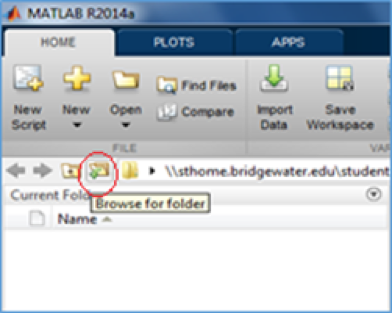
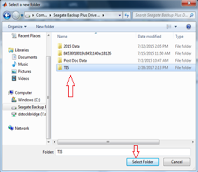
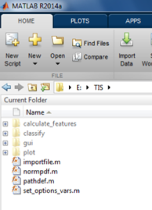
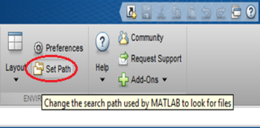
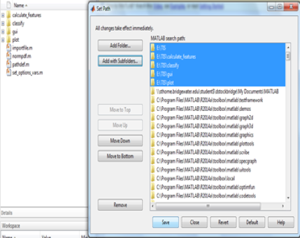
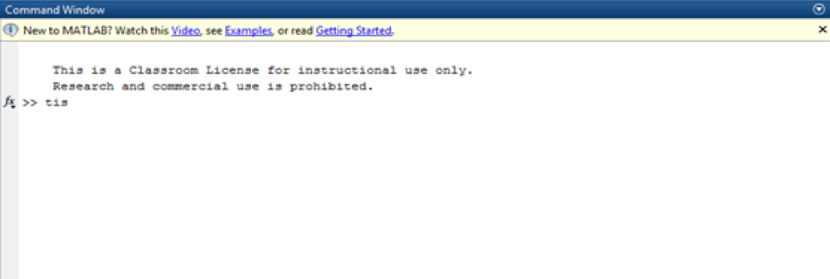
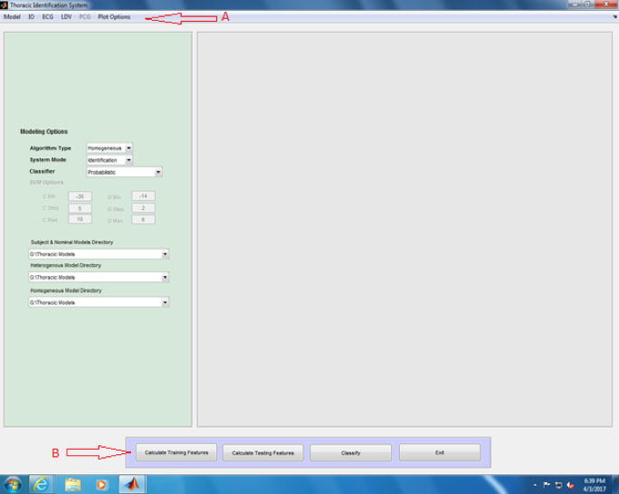

### Installing and Loading TIS

You can download the TIS software from [here](http://github.com/erimcg/tis).

To load the TIS software, open Matlab and click on the `Browse for folder` icon that is shown in **Figure 1.** 

**Figure 1**

Next, choose the folder where the TIS software was saved and press `Select Folder`.

 **Figure 2**

After loading TIS, you will see a list of files and folders in the Current Folder list on the side bar. If some of the folders are greyed out then add these files and folders to the Matlab *path*.
 

**Figure 3**

To add these files to the path, press the icon labeled `Set path` located in the main toolbar. 

**Figure 4**

When the dialogue box opens, click `Add with Subfolders…`, then select the contents of the TIS folder. 

**Figure 5**
 
Click `Save` to save the files and folders to the Matlab path and press `Close` to exit the dialog box to return to Matlab. The previously grey areas should be black. 

To run TIS, type `TIS` into the Command Window and press `Enter` as shown in **Figure 6.** 

**Figure 6**

Matlab will open the TIS Graphical User Interface (GUI) as shown in **Figure 7**. The TIS GUI displays a menu bar (A) across the top of the screen that allow the user to change various settings. Below the menu bar are options to calculate and classify the feature sets (B).
 
 
**Figure 7**

You're now ready to setup TIS to calculate feature sets for your input data.

[Next: Selecting a Classifier](Selecting-Classifier.md)
