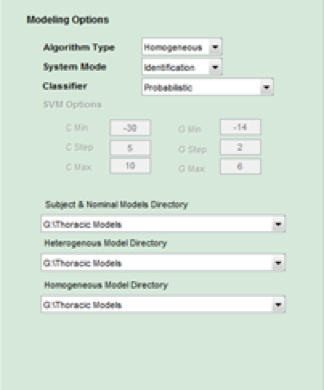

## Model and Classifier Settings 

When you click on `Model` in the toolbar, the left pane will display a set of Modeling Options.

 
**Figure 9**

The first option is `Algorithm Type` which defaults to `Homogeneous`. In the future there may be an option for heterogeneous identification, but it is disabled at this time. 

The second option, `System Mode` defaults to `Identification`. Again, in the future there may be an option for authentication, but it is disabled at this time.

The third option allows the user choose between a `Probabilistic` and `Support Vector Machine` (SVM) classifier.  The probabilistic classifier is based on the algorithm found in [[1](References.md/#1)]. 

The SVM classifier is from [[2](References.md/#2)]. When SVM is selected the `SVM Options` fields will cease to be greyed out allowing the user may change the C and G SVM parameters. 

At the bottom of the Modeling Options pane, are three directories fields that allow the user to enter where they would like the system to store the model files that are created when the system is constructing the feature sets. To change a directory, right click on the field and choose a directory. These directories must be writable.

[Next: Configuring the Input Settings](Input-Settings.md)
