## Plot Options

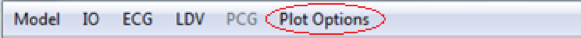 Figure 26

While TIS is computing feature sets and training and testing the classifiers, TIS can display various plots.  To turn these plots on and off choose Plot Options from the main menu.  

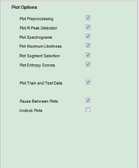 Figure 27

The 'Pause Between Plots` option will display a plot for each subjects and requires the user to press the `Enter` key before moving on to the next subject. 

To make the plots show in full screen mode, check the `Undock Plots` box. 

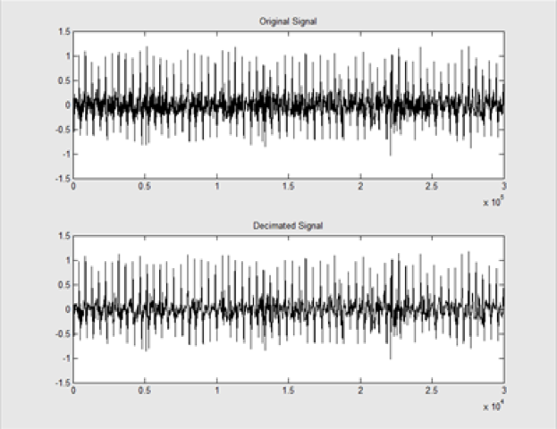 Figure 29

`Plot Preprocessing` displays the subject's original signal and the signal after preprocessing (down-sampling and filtering).

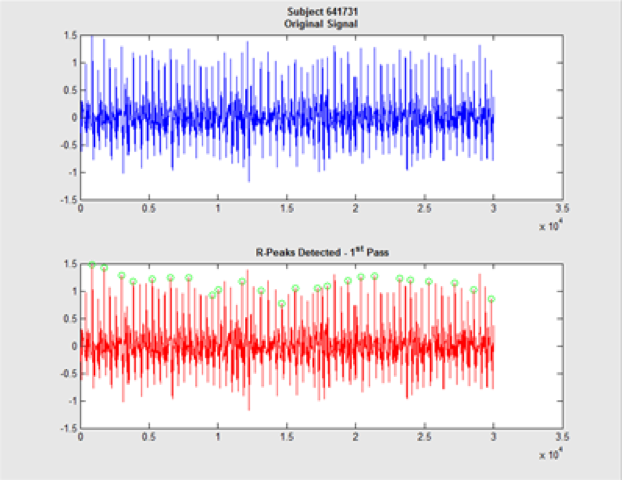
Figure 30

`Peak Detection' displays both the signal after preprocessing and a plot showing the peaks that were detected (green circles). 

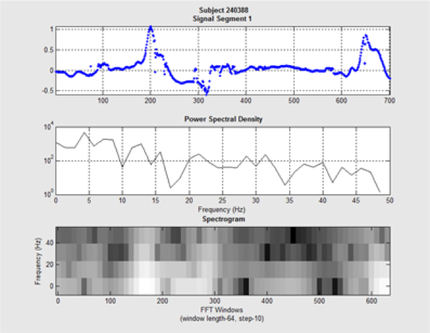
Figure 31

`Plot Spectrogram` displays 3 plots. The first plot shows the segment as determined by the Segmentation Boundaries option in the LDV and ECG menus. The second plot shows the power spectral denisity of the segment. The bottom graph shows the spectrogram for the segment. 

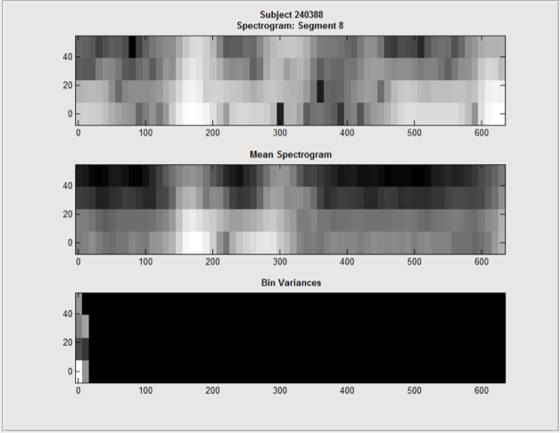
Figure 32

`Plot Maximum Likelihood' shows the dynamic computation of a subjects mean spectrogram and bin variances.  The first plot shows the sepectrogram being analyzed, the second plot shows the mean spectrogram as it is being computed, and the third plot shows the bin variances as they are being computed. 

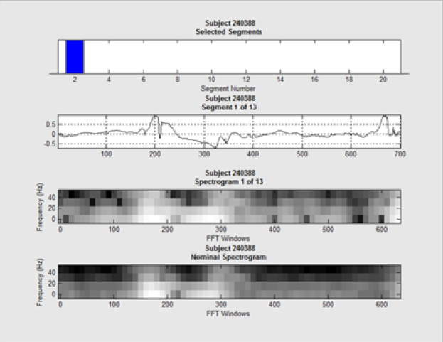
Figure 33

`Plot Segment Selection` shows which segments are chosen for each subject.  The first plot displays blue bars to identify which segments are being selected. This is dependent on the selection modes chosen in the Train and Test Options. The second plot shows the segment after preprocessing. The third plot shows the computed spectrograms for the particular segment. The fourth plot shows the nominal spectrogram for the subject. 

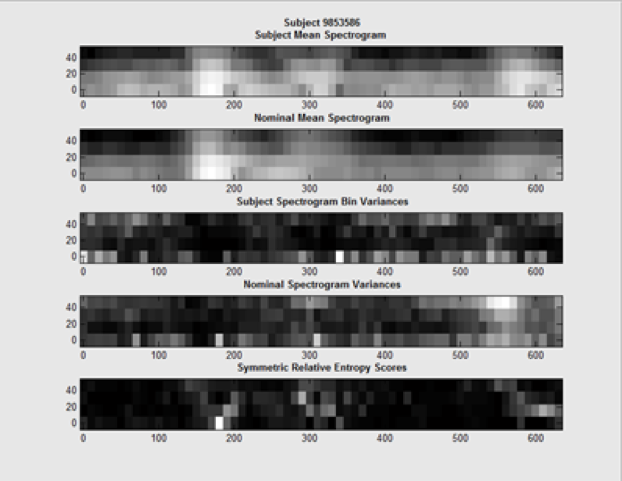
Figure 34

'Plot Entropy Scores' dynamically shows the computation of the symmetric relative entropy scores. The subject mean spectrogram shows the mean of all of the spectrograms for the individual. The Nominal Mean Spectrogram shows the mean spectrogram of the population. The entropy scores are determined by the how much data is in each bin. A low score is ideal for picking individual bins, because it means that the data is dissimilar to the nominal mean. 

Figure 35
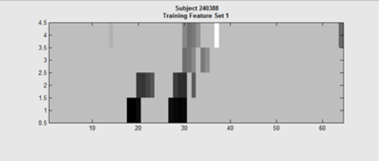

Plot Train and Test Data shows the actual feature set. This shows the bins that weren't zeroed out, and show the bins that were chosen for the subject's feature set.
After calculating the training and testing features, press calculate and return to the command window in Matlab. This is where the software will give the identification rate. Figure 35 shows whether each subject was a true or false match. The number following the rank_k_counts shows how many subjects were correctly matched at the first rank. Figure 36 shows the rate of identification at each rank.

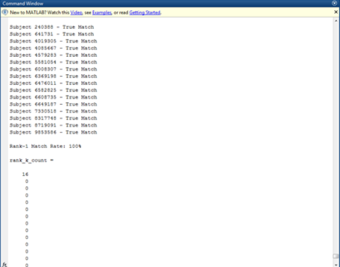
Figure 36

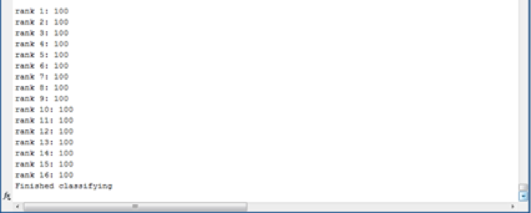
Figure 37

[Next: Train and Test the Classifier](Train-Test.md)
