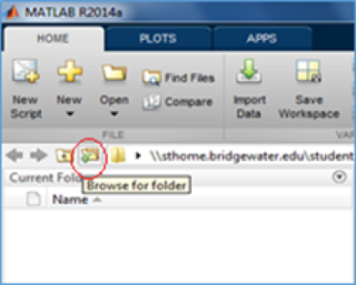

#### Installing and Setting Up TIS

1. **Install and set up TIS **
2. Configure the settings for your training set 
3. Calculate the training feature sets 
4. Modify the setting for your testing set (optional) 
5. Calculate the testing feature sets 
6. Classify the testing feature sets against the training feature sets 

You can download the TIS software from [here](http://github.com/erimcg/tis).

To start the TIS software, open Matlab and click on the Browse for folder icon that is shown in **Figure 1.** 

**Figure 1**

Next choose the file where the TIS software is saved. 

 **Figure 2**

After opening TIS, you will see a list of files and folders in the Current Folder list on the side bar. If some of these are greyed out add these files and folders to the path in Matlab. 

**Figure 3**

To do add these files to the path pick on the icon that says add to path. 

**Figure 4**

When the dialogue box opens click “Add with Subfolders…” and select the contents of the TIS folder. 
 
**Figure 5**
 
Click save to save the files and folders to the Matlab path and press Close to exit the dialouge box and return to Matlab. The previously grey areas should be black
To run TIS, type TIS into the Command Window and press enter as shown in **Figure 6.** 

**Figure 6**

Matlab will open the TIS Graphical User Interface (GUI) as shown in Figure C. The TIS GUI displays a menu bar (A) across the top of the screen that allow the user to change various settings pertaining to the user’s data. Below the menu bar are options to calculate or classify the data (B). 
 

**Figure 7**

