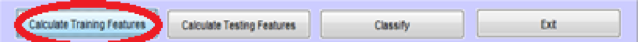

## Train and Test the Classifier

Once you've configured the software for your particular datasets you are ready to create the feature sets and classify the testing feature sets against the training feature sets.  These operations can be executed using the button panel at the bottom of the main pane as shown in **Figure 38** below.

To start the process simply press the `Calculate Training Features` button. When pressed, TIS will compute the feature sets for the training data. When it has completed, "Calculate training features complete" will appear on the Matlab console.

After the training features have been computed, press the `Calculate Testing Features` button.  When the testing features have been computed, "Calculate testing features complete" will appear on the Matlab console.

Once you've computed the training and testing feature sets, you're ready to classify.  To classify the testing feature sets against the set of training feature sets, press the `Classfiy` button. After TIS has classified the data, the results will be displayed either on the Matlab console in the case of the probabalistic classifier, or they will be displayed on the main TIS pane in the case of the SVM classifier.
